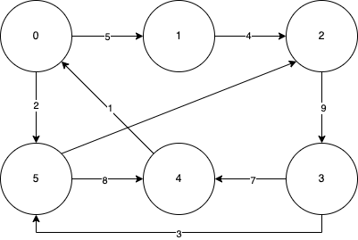
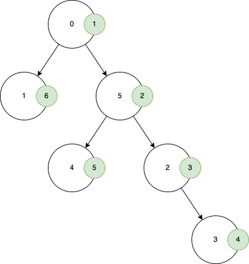

# Thông tin chung

- Thành viên:
    - Nguyễn Bảo Long - 22C11065
    - Trần Xuân Lộc - 22C11067

- Bảng phân công công việc:

**Công việc**|**Người thực hiện**
:------------------:|:----------------------------------------:
Tái cấu trúc đồ thị theo yêu cầu của thầy|Xuân Lộc
Viết hàm và tài liệu cho thuật toán `DFS`|Bảo Long
Viết hàm và tài liệu cho thuật toán `BFS`|Xuân Lộc

\newpage

# Cấu trúc mã nguồn

- Tại đây mô tả về schema của các class và thông tin (tóm tắt, đầu vào, đầu ra) của các hàm.

## Schema

## File `graph.py`

### Cấu trúc dữ liệu đồ thị bao gồm:

- `self.vertList`: Biến có kiểu dữ liệu từ điển, chứa danh sách đỉnh của đồ thị. Mỗi phần tử trong từ điển có khóa là định danh của đỉnh (`id`) và giá trị là một đối tượng có kiểu dữ liệu `Vertex`.
- `self.numVertices`: Biến có kiểu dữ liệu là số nguyên, xác định số đỉnh của đồ thị.

### Các hàm thành phần

- Hàm `addVertex(self, key)`:
    - Mô tả: Hàm thêm một đỉnh vào cấu trúc dữ liệu đồ thị.
    - Tham số:
        - `key`: Định danh của một đỉnh.
    - Trả về: Đỉnh vừa được thêm vào dưới dạng một đối tượng `Vertex`.

- Hàm `getVertex(self, n)`:
    - Mô tả: Hàm lấy thông tin của đỉnh có định danh `n` của đồ thị
    - Tham số:
        - `n`: Định danh (`id`) của đỉnh trong đồ thị.
    - Trả về:
        - Đối tượng `Vertex` có định danh `n`, nếu đỉnh `n` có tồn tại trong đồ thị.
        - `None`, nếu trong đồ thị không tồn tại đỉnh có định danh `n`.

- Hàm `__contains__(self, n)`:
    - Mô tả: Hàm kiểm tra đỉnh có định danh `n` có tồn tại trong đồ thị hay không.
    - Tham số:
        - `n`: Định danh (`id`) của một đỉnh.
    - Trả về:
        - `True`, nếu đỉnh `n` tồn tại trong đồ thị.
        - `False`, nếu đỉnh `n` không tồn tại trong đồ thị.

- Hàm `addEdge(self, f, t, weight=0)`:
    - Mô tả: Hàm thêm một cạnh có trọng số `weight` (mặc định bằng 0) đi từ đỉnh `f` đến đỉnh `t`. Nếu một trong hai đỉnh không tồn tại trong đồ thị thì thêm đỉnh đó vào đồ thị.
    - Tham số:
        - `f`: Định danh của đỉnh xuất phát.
        - `t`: Định danh của đỉnh đích.
        - `weight`: Trọng số của đỉnh được thêm vào. Mặc định bằng 0.

- Hàm `getVertices(self)`:
    - Mô tả: Hàm lấy thông tin của toàn bộ đỉnh trong đồ thị.
    - Tham số: Không.
    - Trả về:
        - Trả về đối tượng `dict_key`, chứa danh sách định danh của toàn bộ đỉnh trong đồ thị.

- Hàm `__iter__(self)`:
    - Mô tả: Hàm hỗ trợ việc duyệt qua mọi đỉnh trong đồ thị.
    - Tham số: Không.
    - Trả về:
        - Đối tượng có kiểu dữ liệu `iterator`, hỗ trợ việc duyệt qua mọi đỉnh trong đồ thị.

- Hàm `BFS(self, vertex_ith)`:
    - Mô tả: Hàm duyệt qua tất cả các đỉnh trong đồ thị bằng thuật toán `BFS` với đỉnh bắt đầu là `vertex_ith`.
    - Tham số:
        - `vertex_ith`: Định danh (`id`) của đỉnh bắt đầu.
    - Trả về:
        - Thứ tự đỉnh được duyệt qua bởi thuật toán `BFS`.

- Hàm `DFS(self, vertex_ith)`:
    - Mô tả: Hàm duyệt qua tất cả các đỉnh trong đồ thị bằng thuật toán `DFS` với đỉnh bắt đầu là `vertex_ith`.
    - Tham số:
        - `vertex_ith`: Định danh (`id`) của đỉnh bắt đầu.
    - Trả về:
        - Thứ tự đỉnh được duyệt qua bởi thuật toán `DFS`.

- Hàm `save_path(path: list, file_name=None, mode='stdout')`:
    - Mô tả:
    - Tham số:
    - Trả về:

## File `vertex.py`

\newpage

## Mô tả thuật toán DFS, BFS

### Thuật toán DFS

- Ý tưởng thuật toán: Bắt đầu từ đỉnh xuất phát đi xa nhất có thể, đến khi không thể đi được nữa thì quay lui (backtracking). Chính vì vậy, có thể cài đặt thuật toán này bằng đệ quy hoặc sử dụng một ngăn xếp.

- Minh họa thuật toán:
    - Đồ thị:

        

    - Quá trình duyệt đồ thị:

        | current node |  stack  |    visited    |
        |:------------:|:-------:|:-------------:|
        |       0      |  {1,5}  |      {0}      |
        |       5      | {1,4,2} |     {0,5}     |
        |       2      | {1,4,3} |    {0,5,2}    |
        |       3      |  {1,4}  |   {0,5,2,3}   |
        |       4      |   {1}   |  {0,5,2,3,4}  |
        |       1      |    {}   | {0,5,2,3,4,1} |

    - Kết quả: Thứ tự duyệt của đồ thị là $\{0,5,2,3,4,1\}$

    - Minh họa bằng cây tìm kiếm:

        

### Thuật toán BFS

\newpage

# Tài liệu tham khảo

- Tài liệu tham khảo
