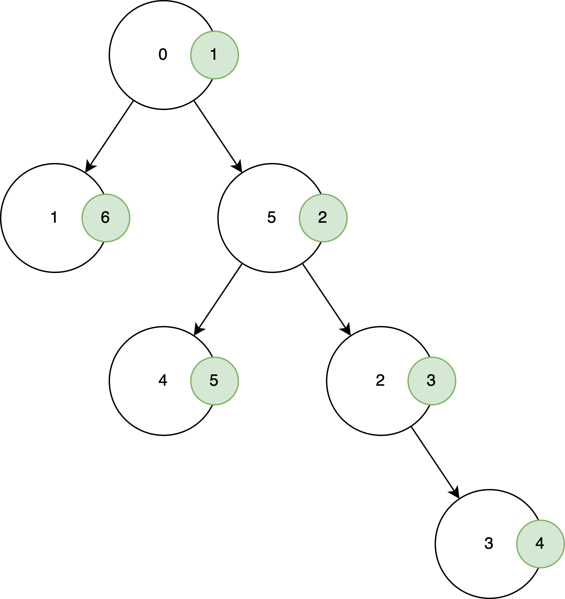

# Thông tin chung

- Thành viên:
    - Trần Xuân Lộc - 22C11064
    - Lê Nhựt Nam - 22C11067

- Bảng phân công công việc:

**Công việc**|**Người thực hiện**
:------------------:|:----------------------------------------:
Tái cấu trúc đồ thị theo yêu cầu của thầy|Xuân Lộc
Viết hàm và tài liệu cho thuật toán `BFS`, `Kerninghan-Lin`, `Fiduccia-Mattheyses`, và `Spectral Bisection` |Nhựt Nam
Viết hàm và tài liệu cho thuật toán `BFS`|Xuân Lộc

\newpage

# Cấu trúc mã nguồn

- Tại đây mô tả về schema của các class và thông tin (tóm tắt, đầu vào, đầu ra) của các hàm.


## Tổ chức dữ liệu đồ thị của lớp `Graph`

Trong phần này, nhóm sẽ trình bày cách tổ chức lưu trữ dữ liệu đồ thị vào trong lớp `Graph` bao gồm các thành phần lưu trữ dữ liệu và mô tả các hàm thực thi phục vụ cho lớp. Tệp `graph.py` lưu trữ thông tin cấu hình chi tiết và mã nguồn.

### Cấu trúc dữ liệu đồ thị

- `self.vertList`: Biến có kiểu dữ liệu từ điển, chứa danh sách đỉnh của đồ thị. Mỗi phần tử trong từ điển có khóa là định danh của đỉnh (`id`) và giá trị là một đối tượng có kiểu dữ liệu `Vertex`.
- `self.numVertices`: Biến có kiểu dữ liệu là số nguyên, xác định số đỉnh của đồ thị.

### Các hàm thành phần

- Hàm `addVertex(self, key)`:
    - Mô tả: Hàm thêm một đỉnh vào cấu trúc dữ liệu đồ thị.
    - Tham số:
        - `key`: Định danh của một đỉnh.
    - Trả về: Đỉnh vừa được thêm vào dưới dạng một đối tượng `Vertex`.

- Hàm `getVertex(self, n)`:
    - Mô tả: Hàm lấy thông tin của đỉnh có định danh `n` của đồ thị
    - Tham số:
        - `n`: Định danh (`id`) của đỉnh trong đồ thị.
    - Trả về:
        - Đối tượng `Vertex` có định danh `n`, nếu đỉnh `n` có tồn tại trong đồ thị.
        - `None`, nếu trong đồ thị không tồn tại đỉnh có định danh `n`.

- Hàm `__contains__(self, n)`:
    - Mô tả: Hàm kiểm tra đỉnh có định danh `n` có tồn tại trong đồ thị hay không.
    - Tham số:
        - `n`: Định danh (`id`) của một đỉnh.
    - Trả về:
        - `True`, nếu đỉnh `n` tồn tại trong đồ thị.
        - `False`, nếu đỉnh `n` không tồn tại trong đồ thị.

- Hàm `addEdge(self, f, t, weight=0)`:
    - Mô tả: Hàm thêm một cạnh có trọng số `weight` (mặc định bằng 0) đi từ đỉnh `f` đến đỉnh `t`. Nếu một trong hai đỉnh không tồn tại trong đồ thị thì thêm đỉnh đó vào đồ thị.
    - Tham số:
        - `f`: Định danh của đỉnh xuất phát.
        - `t`: Định danh của đỉnh đích.
        - `weight`: Trọng số của đỉnh được thêm vào. Mặc định bằng 0.

- Hàm `getVertices(self)`:
    - Mô tả: Hàm lấy thông tin của toàn bộ đỉnh trong đồ thị.
    - Tham số: Không.
    - Trả về:
        - Trả về đối tượng `dict_key`, chứa danh sách định danh của toàn bộ đỉnh trong đồ thị.

- Hàm `__iter__(self)`:
    - Mô tả: Hàm hỗ trợ việc duyệt qua mọi đỉnh trong đồ thị.
    - Tham số: Không.
    - Trả về:
        - Đối tượng có kiểu dữ liệu `iterator`, hỗ trợ việc duyệt qua mọi đỉnh trong đồ thị.

- Hàm `BFS(self, vertex_ith)`:
    - Mô tả: Hàm duyệt qua tất cả các đỉnh trong đồ thị bằng thuật toán `BFS` với đỉnh bắt đầu là `vertex_ith`.
    - Tham số:
        - `vertex_ith`: Định danh (`id`) của đỉnh bắt đầu.
    - Trả về:
        - Thứ tự đỉnh được duyệt qua bởi thuật toán `BFS`.

- Hàm `DFS(self, vertex_ith)`:
    - Mô tả: Hàm duyệt qua tất cả các đỉnh trong đồ thị bằng thuật toán `DFS` với đỉnh bắt đầu là `vertex_ith`.
    - Tham số:
        - `vertex_ith`: Định danh (`id`) của đỉnh bắt đầu.
    - Trả về:
        - Thứ tự đỉnh được duyệt qua bởi thuật toán `DFS`.

- Hàm `save_path(path: list, file_name=None, mode='stdout')`:
    - Mô tả: Hàm hỗ trợ lưu kết quả dưới dạng tệp hoặc hiển thị kết quả ra màn hình.
    - Tham số:
        - `path`: Danh sách lưu lại các thứ tự duyệt các nút của các thuật toán.
        - `file_name`: Biến lưu giá trị tên tệp lưu kết quả, nếu `mode='write_to_file'` nhưng giá trị biến rỗng sẽ báo lỗi cho người dùng.
        - `mode`: Biến mang cấu hình hiện thị ra màn hình nếu `mode='stdout'` (giá trị mặc định) hoặc ghi kết quả vào tệp `mode='write_to_file'`.
    - Trả về: Không

Trong bài lab này, chúng em thiết kế thêm một số hàm hỗ trợ tính toán ma trận kề, bậc của đỉnh và ma trận Laplacian cho đồ thị

- Hàm `compute_adjacency_matrix(self, )`: 
    - Trả về: mảng numpy thể hiện biểu diễn ma trận kề của đồ thị.
- Hàm `degree_nodes(self, adjacency_matrix)`:
    - Trả về: numpy vector thể hiện bậc của các đỉnh trong đồ thị.
- Hàm `compute_laplacian_matrix(self, )`:
    - Trả về: mảng numpy thể hiện biểu diễn ma trận Laplacian của đồ thị.

## Tổ chức dữ liệu đỉnh của lớp `Vertex`

Tiếp theo, nhóm sẽ trình bày cách tổ chức lưu trữ dữ liệu của các đỉnh bao gồm định danh đỉnh và tập hợp các láng giềng kề với đỉnh đó. Ngoài ra, chúng em cũng mô tả thêm các hàm thực thi hỗ trợ cho lớp này và các hàm này được lưu trong tệp `vertex.py`.

### Cấu trúc dữ liệu của lớp đỉnh `Vertex`

- `self.id`: Biến lưu trữ định danh của một đỉnh, có kiểu dữ liệu bất kì - `Any`, không có ràng buộc có thể là kiểu số hoặc chuỗi tùy ý.
- `self.connectedTo`: Biến lưu trữ tập hợp các láng giềng có kề với đỉnh hiện tại, kiểu dữ liệu lưu trữ là từ điển - `dict`.

Trong bài lab này chúng em bổ sung một số thuộc tính cho cấu trúc dữ liệu này để thuận tiện hơn trong quá trình cài đặt thuật toán phân hoạch đồ thị
- `self.level`: Lưu trữ level của đỉnh sau khi được viếng thăm bởi thuật toán BFS, sau đó được dùng cho thuật toán phân hoạch đồ thị dựa trên ngưỡng
- `self.partition_label`: thuộc tính nhãn phân hoạch dùng để xác định đỉnh nằm trong tập phân hoạch nào. Biến này sử dụng cho việc cài đặt thuật toán: Fiduccia-Mattheyses, và Kerninghan-Lin
- `self.external_cost` và `self.internal_cost`: thuộc tính chi phí nội tại và chi phí ngoại tại của phân hoạch. Các biến này sử dụng cho việc cài đặt thuật toán: Fiduccia-Mattheyses, và Kerninghan-Lin

### Các hàm thành phần
- Hàm `addNeighbor(self, nbr, weight=0)`:
    - Mô tả: Hàm thêm láng giềng `nbr` có liên kết với đỉnh hiện tại với trọng số mặc định `weight=0`.
    - Tham số:
        - `nbr`: láng giềng của định đang xét.
        - `weight`: giá trị thể hiện trọng số liên kết.
    - Trả về: Không
- Hàm `__str__(self)`:
    - Mô tả: Hàm mô tả đỉnh thông qua các thông số lưu trữ.
    - Tham số: Không
    - Trả về: Chuỗi bao gồm định danh và tập hợp các đỉnh kề của đỉnh đó.
- Hàm `getConnections(self)`:
    - Mô tả: hàm trả về
    - Tham số: Không
    - Trả về: mảng các đỉnh có liên kết với đỉnh hiện tại thông qua giá trị của biến `self.connectedTo`.
- Hàm `getId(self)`:
    - Mô tả: Hàm trả về định danh của đỉnh hiện tại.
    - Tham số: Không
    - Trả về: Định danh của đỉnh hiện tại của đỉnh với kiểu dữ liệu bất kì `Any`.
- Hàm `getWeight(self, nbr)`:
    - Mô tả: Hàm trả về trọng số liên kết của đỉnh `nbr` với đỉnh đang xét.
    - Tham số:
        - `nbr`: láng giềng của đỉnh hiện tại.
    - Trả về: Trọng số của cạnh giữa đỉnh hiện tại và `nbr`.

## Các hàm hỗ trợ
Phần này sẽ tập trung mô tả các hàm hỗ trợ ghi dữ liệu và hiển thị dữ liệu cho người dùng thông báo tình trạng thực thi các hàm của các lớp. Các hàm này được lưu trong tệp `support.py`.

- Hàm `save_path(path: list, file_name=None, mode='stdout')`:
    - Mô tả: Hàm hỗ trợ lưu kết quả dưới dạng tệp hoặc hiển thị kết quả ra màn hình.
    - Tham số:
        - `path`: Danh sách lưu lại các thứ tự duyệt các nút của các thuật toán.
        - `file_name`: Biến lưu giá trị tên tệp lưu kết quả, nếu `mode='write_to_file'` nhưng giá trị biến rỗng sẽ báo lỗi cho người dùng.
        - `mode`: Biến mang cấu hình hiện thị ra màn hình nếu `mode='stdout'` (giá trị mặc định) hoặc ghi kết quả vào tệp `mode='write_to_file'`.
    - Trả về: Không

- Hàm `get_log(message, log_type='INFO')`:
    - Mô tả: Hàm hỗ trợ ghi thông tin thực thi của hàm bao gồm loại nhật kí ghi, thời gian thực thi và thông điệp muốn ghi lại.
    - Tham số:
        - `path`: Danh sách lưu lại các thứ tự duyệt các nút của các thuật toán.
        - `log_type`: Biến mang cấu hình loại nhật kí được thực thi với giá trị mặc định là `log_type='stdout'`, một số loại nhật kí khác như `WARNING, ERROR, DEBUG`
    - Trả về: Chuỗi lưu trữ nhật kí hoặc thông tin thực thi tại thời điểm gọi hàm.

\newpage

## Mô tả thuật toán DFS, BFS

### Thuật toán DFS

- Ý tưởng thuật toán: Bắt đầu từ đỉnh xuất phát đi xa nhất có thể, đến khi không thể đi được nữa thì quay lui (backtracking). Chính vì vậy, có thể cài đặt thuật toán này bằng đệ quy hoặc sử dụng một ngăn xếp.

- Thuật toán được cài đặt như sau:

    ```python
    def DFS(self, vertex_ith: int):
        """depth first search function, start from `vertex_ith`
        Args: vertex_ith (int): key of vertex in graph
        Raises: ValueError: can't find a vertex with given key
        Returns: list[int]: the path that DFS agent has gone through
        """
        vertex: Vertex = self.getVertex(vertex_ith)
        if vertex is None:
            message = 'Invalid vertex id, could not found vertex id `' + str(vertex_ith) + '` in Graph'
            raise ValueError(get_log(message, log_type='ERROR'))

        closed_set: list[int] = []
        open_set: list[int] = [vertex.getId()]

        while open_set:
            cur_vertex: Vertex = self.getVertex(open_set.pop())
            cur_vertex_id = cur_vertex.getId()

            if cur_vertex_id not in closed_set:
                closed_set.append(cur_vertex_id)
                neighbors = [x.id for x in cur_vertex.getConnections()]

                for neighbor in neighbors:
                    if neighbor not in closed_set:
                        open_set.append(neighbor)
        return closed_set
    ```

- Minh họa thuật toán:
    - Đồ thị:

        

    - Quá trình duyệt đồ thị:

        | current node |  stack  |    visited    |
        |:------------:|:-------:|:-------------:|
        |       0      |  {1,5}  |      {0}      |
        |       5      | {1,4,2} |     {0,5}     |
        |       2      | {1,4,3} |    {0,5,2}    |
        |       3      |  {1,4}  |   {0,5,2,3}   |
        |       4      |   {1}   |  {0,5,2,3,4}  |
        |       1      |    {}   | {0,5,2,3,4,1} |

    - Kết quả: Thứ tự duyệt của đồ thị là $\{0,5,2,3,4,1\}$

    - Minh họa bằng cây tìm kiếm:

        {height=60%}

### Thuật toán BFS

- Ý tưởng thuật toán: Bắt đầu từ đỉnh xuất phát đi rộng nhất có thể, đến khi không thể đi được nữa thì quay lại đi xuống 1 bậc đồ thị để tiếp tục quá trình tương tự. Do đó, ta có thể cài đặt thuật toán này bằng 1 hàng đợi và 1 mảng đánh dấu đã duyệt là đủ.

- Cấu hình thuật toán được thể hiện ở bên dưới.

    ```python
    def BFS(self, vertex_ith: int):
        """
        Module applying Breadth First Search Algorithm.

        :param vertex_ith: the vertex id in Graph
        :return: path computed by BFS
        """
        # get the vertex `vertex_ith`.
        vertex = self.getVertex(vertex_ith)

        # checking if not exist `vertex_ith` in Graph then raise error
        if not vertex:
            message = 'Invalid vertex id, could not found vertex id `' + str(vertex_ith) + '` in Graph'
            raise ValueError(get_log(message, log_type='ERROR'))
        
        # get the number of vertices.
        n = self.numVertices

        # bool array for marking visited or not.
        visited = [False] * n

        # get the vertex_id for easy management.
        vertex_id = vertex.getId()
        
        # initializing a queue to handling which vertex is remaining.
        queue = [vertex_id]

        # marking the `vertex_id` is visited due to the beginning vertex.
        visited[vertex_id] = True

        # path to track the working state of BFS.
        path = []
        while queue:
            # handling current vertex before removing out of queue.
            cur_pos = queue[0]

            # appending to path to track.
            path.append(cur_pos)
            # remove it out of queue
            queue.pop(0)
            # get all neighbors id of current vertex.
            neighbor_cur_pos = [x.id for x in self.getVertex(cur_pos).getConnections()]

            # loop over the neighbor of current vertex.
            for neighborId in neighbor_cur_pos:
                # if not visited then push that vertex into queue.
                if not visited[neighborId]:
                    visited[neighborId] = True
                    queue.append(neighborId)
        return path
    ```

- Minh họa thuật toán:
    - Đồ thị:

        

    - Quá trình duyệt đồ thị:

        | current node |  stack  |    visited    |
        |:------------:|:-------:|:-------------:|
        |       0      |  {1,5}  |      {0}      |
        |       1      |  {5,2}  |     {0,1}     |
        |       5      |  {2,4}  |    {0,1,5}    |
        |       2      |  {4,3}  |   {0,1,5,2}   |
        |       4      |   {3}   |  {0,1,5,2,4}  |
        |       3      |    {}   | {0,1,5,2,4,3} |

    - Kết quả: Thứ tự duyệt của đồ thị là $\{0,1,5,2,4,3\}$

    - Minh họa bằng cây tìm kiếm:

        {height=60%}

\newpage

## Mô tả thuật toán phân hoạch đồ thị

### Phát biểu bài toán

Xem xét đồ thị  $\mathcal{G} = (\mathcal{V}, \mathcal{E})$, trong đó $\mathcal{V}$ đại diện cho tập hợp $n$ đỉnh, $\mathcal{E}$ đại diện cho tập hợp các cạnh.

Với một bài toán phân hoạch cân bằng $(k, v)$m mục tiêu là phân hoạch đồ thị $\mathcal{G}$ thành $k$ thành phần có kích thước lớn nhất là $v \cdot \frac{n}{k}$ trong khi cực tiểu capacity của các cạnh giữa các thành phần phân hoạch (có thể định nghĩa capacity theo nhiều cách).

Trong báo cáo kỹ thuật này, chúng em xem xét bài toán phân hoạch đồ thị thành hai thành phần. Chúng em thực hiện cài đặt các thuật toán như sau:

- BFS

- Kernighan-Lin Algorithm

- Fiduccia-Mattheyses Partitioning Algorithm

- Spectral Bisection

- $k$-way partitioning

### Thuật toán phân hoạch dựa trên BFS

Thuật toán tìm kiếm theo chiều rộng có thể sử dụng để giải quyết bài toán phân hoạch đồ thị. 

Ý tưởng: Thuật toán BFS duyệt đồ thị theo từng mức (level by level), và bằng cách đánh dấu mỗi đỉnh với level mà nó được viếng thăm. Tập hợp các đỉnh của đồ thị được phân thành hai phần $V_1$ và $V_2$ bằng cách đặt những đỉnh mà có level nhỏ hơn hoặc bằng một nhưỡng $L$ được xác định từ trước.

```py
def pa_bfs(graph, vertex_ith: int, threshold: int):
    """Algorithm description:
        We can use basic graph search algorithm to solve graph partition algorithm :)
        Basically, the well-known BFS (Breadth-First-Search) algorithm can be modified to help us divide graph into two parts.
        BFS algorithm traverses the graph level by level and marks each vertex with the level in which it was visited. 
        After completion of the traversal, the set of vertices of the graph is portioned into two parts $V_1$ and $V_2$ by putting 
        all vertices with level less than or equal to a pre-determined threshold $L$ in the set V1 and putting the remaining vertices 
        (with level greater than $L$) in the set $V_2$. $L$ is so chosen that $|V1|$ is close to $|V2|$.

    References: 
    [1] Graph Partitioning, https://patterns.eecs.berkeley.edu/?page_id=571#1_BFS
    """
    L1 = set()
    L2 = set()

    # get the vertex `vertex_ith`.
    vertex = graph.getVertex(vertex_ith)

    # checking if not exist `vertex_ith` in Graph then raise error.
    if not vertex:
        message = 'Invalid vertex id, could not found vertex id `' + \
            str(vertex_ith) + '` in Graph'
        raise ValueError(get_log(message, log_type='ERROR'))

    # get the number of vertices.
    n = graph.numVertices

    # bool array for marking visited or not.
    visited = [False] * n

    # get the vertex_id for easy management.
    vertex_id = vertex.getId()

    # initializing a queue to handling which vertex is remaining.
    queue = [vertex_id]

    # marking the `vertex_id` is visited due to the beginning vertex.
    visited[vertex_id] = True

    path = []  # path to track the working state of BFS.

    level = 0
    while queue:
        # handling current vertex before removing out of queue.
        cur_pos = queue[0]

        # appending to path to track.
        path.append(cur_pos)

        # remove it out of queue
        queue.pop(0)

        # get all neighbors id of current vertex.
        neighbor_cur_pos = [
            x.id for x in graph.getVertex(cur_pos).getConnections()]

        # loop over the neighbor of current vertex.
        for neighborId in neighbor_cur_pos:
            # if not visited then push that vertex into queue.
            if not visited[neighborId]:
                visited[neighborId] = True
                graph.vertList[neighborId].level = level
                if level >= threshold:
                    L2.add(neighborId)
                else:
                    L1.add(neighborId)
                queue.append(neighborId)
        level += 1

    logging.info("Group A vertices: {}".format(L1))
    logging.info("Group B vertices: {}".format(L2))
    return L1, L2
```

### Thuật toán Kernighan-Lin

### Thuật toán Fiduccia-Mattheyses Partitioning

### Thuật toán Spectral Bisection

### Thuật toán $k$-way partitioning

# Tài liệu tham khảo

- Một số bài toán cơ bản trong phân tích dữ liệu. (n.d.). Thuc Nguyen Dinh.
