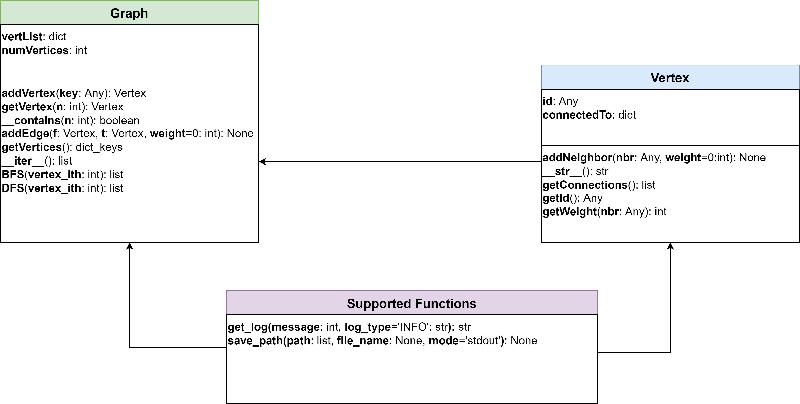
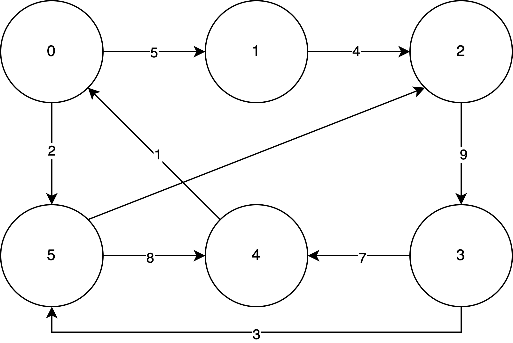
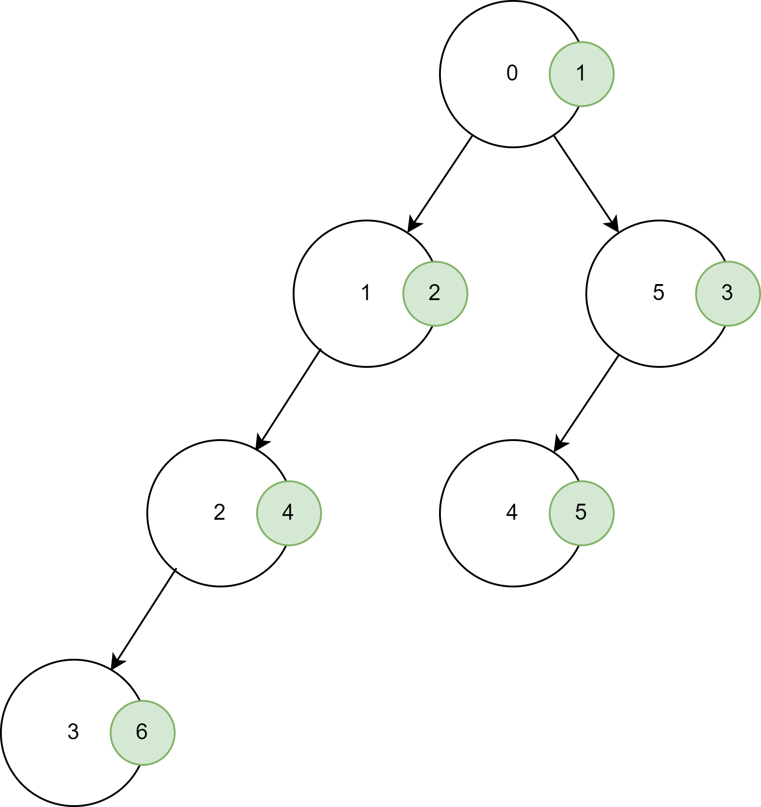

# Thông tin chung

- Thành viên:
    - Trần Xuân Lộc - 22C11064
    - Lê Nhựt Nam - 22C11067

- Bảng phân công công việc:

**Công việc**|**Người thực hiện**
:------------------:|:----------------------------------------:
Tái cấu trúc đồ thị theo yêu cầu của thầy|Xuân Lộc
Viết hàm và tài liệu cho thuật toán `BFS`, `Kerninghan-Lin`, `Fiduccia-Mattheyses` và `Spectral Bisection` |Nhựt Nam
Viết hàm và tài liệu cho thuật toán `BFS`, `Recursive bisection`, `Greedy Graph Coloring` và `K-medoids`|Xuân Lộc

\newpage

# Cấu trúc mã nguồn

- Tại đây mô tả về schema của các class và thông tin (tóm tắt, đầu vào, đầu ra) của các hàm.




## Tổ chức dữ liệu đồ thị của lớp `Graph`

Trong phần này, nhóm sẽ trình bày cách tổ chức lưu trữ dữ liệu đồ thị vào trong lớp `Graph` bao gồm các thành phần lưu trữ dữ liệu và mô tả các hàm thực thi phục vụ cho lớp. Tệp `graph.py` lưu trữ thông tin cấu hình chi tiết và mã nguồn.

### Cấu trúc dữ liệu đồ thị

- `self.vertList`: Biến có kiểu dữ liệu từ điển, chứa danh sách đỉnh của đồ thị. Mỗi phần tử trong từ điển có khóa là định danh của đỉnh (`id`) và giá trị là một đối tượng có kiểu dữ liệu `Vertex`.
- `self.numVertices`: Biến có kiểu dữ liệu là số nguyên, xác định số đỉnh của đồ thị.

### Các hàm thành phần

- Hàm `addVertex(self, key)`:
    - Mô tả: Hàm thêm một đỉnh vào cấu trúc dữ liệu đồ thị.
    - Tham số:
        - `key`: Định danh của một đỉnh.
    - Trả về: Đỉnh vừa được thêm vào dưới dạng một đối tượng `Vertex`.

- Hàm `getVertex(self, n)`:
    - Mô tả: Hàm lấy thông tin của đỉnh có định danh `n` của đồ thị
    - Tham số:
        - `n`: Định danh (`id`) của đỉnh trong đồ thị.
    - Trả về:
        - Đối tượng `Vertex` có định danh `n`, nếu đỉnh `n` có tồn tại trong đồ thị.
        - `None`, nếu trong đồ thị không tồn tại đỉnh có định danh `n`.

- Hàm `__contains__(self, n)`:
    - Mô tả: Hàm kiểm tra đỉnh có định danh `n` có tồn tại trong đồ thị hay không.
    - Tham số:
        - `n`: Định danh (`id`) của một đỉnh.
    - Trả về:
        - `True`, nếu đỉnh `n` tồn tại trong đồ thị.
        - `False`, nếu đỉnh `n` không tồn tại trong đồ thị.

- Hàm `addEdge(self, f, t, weight=0)`:
    - Mô tả: Hàm thêm một cạnh có trọng số `weight` (mặc định bằng 0) đi từ đỉnh `f` đến đỉnh `t`. Nếu một trong hai đỉnh không tồn tại trong đồ thị thì thêm đỉnh đó vào đồ thị.
    - Tham số:
        - `f`: Định danh của đỉnh xuất phát.
        - `t`: Định danh của đỉnh đích.
        - `weight`: Trọng số của đỉnh được thêm vào. Mặc định bằng 0.

- Hàm `getVertices(self)`:
    - Mô tả: Hàm lấy thông tin của toàn bộ đỉnh trong đồ thị.
    - Tham số: Không.
    - Trả về:
        - Trả về đối tượng `dict_key`, chứa danh sách định danh của toàn bộ đỉnh trong đồ thị.

- Hàm `__iter__(self)`:
    - Mô tả: Hàm hỗ trợ việc duyệt qua mọi đỉnh trong đồ thị.
    - Tham số: Không.
    - Trả về:
        - Đối tượng có kiểu dữ liệu `iterator`, hỗ trợ việc duyệt qua mọi đỉnh trong đồ thị.

- Hàm `BFS(self, vertex_ith)`:
    - Mô tả: Hàm duyệt qua tất cả các đỉnh trong đồ thị bằng thuật toán `BFS` với đỉnh bắt đầu là `vertex_ith`.
    - Tham số:
        - `vertex_ith`: Định danh (`id`) của đỉnh bắt đầu.
    - Trả về:
        - Thứ tự đỉnh được duyệt qua bởi thuật toán `BFS`.

- Hàm `DFS(self, vertex_ith)`:
    - Mô tả: Hàm duyệt qua tất cả các đỉnh trong đồ thị bằng thuật toán `DFS` với đỉnh bắt đầu là `vertex_ith`.
    - Tham số:
        - `vertex_ith`: Định danh (`id`) của đỉnh bắt đầu.
    - Trả về:
        - Thứ tự đỉnh được duyệt qua bởi thuật toán `DFS`.

- Hàm `save_path(path: list, file_name=None, mode='stdout')`:
    - Mô tả: Hàm hỗ trợ lưu kết quả dưới dạng tệp hoặc hiển thị kết quả ra màn hình.
    - Tham số:
        - `path`: Danh sách lưu lại các thứ tự duyệt các nút của các thuật toán.
        - `file_name`: Biến lưu giá trị tên tệp lưu kết quả, nếu `mode='write_to_file'` nhưng giá trị biến rỗng sẽ báo lỗi cho người dùng.
        - `mode`: Biến mang cấu hình hiện thị ra màn hình nếu `mode='stdout'` (giá trị mặc định) hoặc ghi kết quả vào tệp `mode='write_to_file'`.
    - Trả về: Không

Trong bài lab này, chúng em thiết kế thêm một số hàm hỗ trợ tính toán ma trận kề, bậc của đỉnh và ma trận Laplacian cho đồ thị

- Hàm `compute_adjacency_matrix(self, )`: 
    - Trả về: mảng numpy thể hiện biểu diễn ma trận kề của đồ thị.

- Hàm `degree_nodes(self, adjacency_matrix)`:
    - Trả về: numpy vector thể hiện bậc của các đỉnh trong đồ thị.

- Hàm `compute_laplacian_matrix(self, )`:
    - Trả về: mảng numpy thể hiện biểu diễn ma trận Laplacian của đồ thị.

- Hàm `get_edge_weight_bfs(self, v1, v2)`: 
    - Trả về khoảng cách giữa 2 đỉnh $v_1$ và $v_2$ trong đồ thị, trả về vô cực nếu không tồn tại liên kết.

- Hàm `compute_total_weight(self)`:
    - Trả về tổng trọng số liên kết của các cạnh trong đồ thị, chia 2 giá trị nếu là đồ thị vô hướng.

- Hàm `initialize_label(self)`:
    - Trả về giá trị khởi tạo nhãn `partition_label` cho đồ thị với mặc định là một nữa số đỉnh mang nhãn `A` và 1 nữa còn lại mang nhãn `B`. 

## Tổ chức dữ liệu đỉnh của lớp `Vertex`

Tiếp theo, nhóm sẽ trình bày cách tổ chức lưu trữ dữ liệu của các đỉnh bao gồm định danh đỉnh và tập hợp các láng giềng kề với đỉnh đó. Ngoài ra, chúng em cũng mô tả thêm các hàm thực thi hỗ trợ cho lớp này và các hàm này được lưu trong tệp `vertex.py`.

### Cấu trúc dữ liệu của lớp đỉnh `Vertex`

- `self.id`: Biến lưu trữ định danh của một đỉnh, có kiểu dữ liệu bất kì - `Any`, không có ràng buộc có thể là kiểu số hoặc chuỗi tùy ý.
- `self.connectedTo`: Biến lưu trữ tập hợp các láng giềng có kề với đỉnh hiện tại, kiểu dữ liệu lưu trữ là từ điển - `dict`.

Trong bài lab này chúng em bổ sung một số thuộc tính cho cấu trúc dữ liệu này để thuận tiện hơn trong quá trình cài đặt thuật toán phân hoạch đồ thị
- `self.level`: Lưu trữ level của đỉnh sau khi được viếng thăm bởi thuật toán BFS, sau đó được dùng cho thuật toán phân hoạch đồ thị dựa trên ngưỡng
- `self.partition_label`: thuộc tính nhãn phân hoạch dùng để xác định đỉnh nằm trong tập phân hoạch nào. Biến này sử dụng cho việc cài đặt thuật toán: Fiduccia-Mattheyses, và Kerninghan-Lin
- `self.external_cost` và `self.internal_cost`: thuộc tính chi phí nội tại và chi phí ngoại tại của phân hoạch. Các biến này sử dụng cho việc cài đặt thuật toán: Fiduccia-Mattheyses, và Kerninghan-Lin

### Các hàm thành phần
- Hàm `addNeighbor(self, nbr, weight=0)`:
    - Mô tả: Hàm thêm láng giềng `nbr` có liên kết với đỉnh hiện tại với trọng số mặc định `weight=0`.
    - Tham số:
        - `nbr`: láng giềng của định đang xét.
        - `weight`: giá trị thể hiện trọng số liên kết.
    - Trả về: Không
- Hàm `__str__(self)`:
    - Mô tả: Hàm mô tả đỉnh thông qua các thông số lưu trữ.
    - Tham số: Không
    - Trả về: Chuỗi bao gồm định danh và tập hợp các đỉnh kề của đỉnh đó.
- Hàm `getConnections(self)`:
    - Mô tả: hàm trả về
    - Tham số: Không
    - Trả về: mảng các đỉnh có liên kết với đỉnh hiện tại thông qua giá trị của biến `self.connectedTo`.
- Hàm `getId(self)`:
    - Mô tả: Hàm trả về định danh của đỉnh hiện tại.
    - Tham số: Không
    - Trả về: Định danh của đỉnh hiện tại của đỉnh với kiểu dữ liệu bất kì `Any`.
- Hàm `getWeight(self, nbr)`:
    - Mô tả: Hàm trả về trọng số liên kết của đỉnh `nbr` với đỉnh đang xét.
    - Tham số:
        - `nbr`: láng giềng của đỉnh hiện tại.
    - Trả về: Trọng số của cạnh giữa đỉnh hiện tại và `nbr`.

## Các hàm hỗ trợ
Phần này sẽ tập trung mô tả các hàm hỗ trợ ghi dữ liệu và hiển thị dữ liệu cho người dùng thông báo tình trạng thực thi các hàm của các lớp. Các hàm này được lưu trong tệp `support.py`.

- Hàm `save_path(path: list, file_name=None, mode='stdout')`:
    - Mô tả: Hàm hỗ trợ lưu kết quả dưới dạng tệp hoặc hiển thị kết quả ra màn hình.
    - Tham số:
        - `path`: Danh sách lưu lại các thứ tự duyệt các nút của các thuật toán.
        - `file_name`: Biến lưu giá trị tên tệp lưu kết quả, nếu `mode='write_to_file'` nhưng giá trị biến rỗng sẽ báo lỗi cho người dùng.
        - `mode`: Biến mang cấu hình hiện thị ra màn hình nếu `mode='stdout'` (giá trị mặc định) hoặc ghi kết quả vào tệp `mode='write_to_file'`.
    - Trả về: Không

- Hàm `get_log(message, log_type='INFO')`:
    - Mô tả: Hàm hỗ trợ ghi thông tin thực thi của hàm bao gồm loại nhật kí ghi, thời gian thực thi và thông điệp muốn ghi lại.
    - Tham số:
        - `path`: Danh sách lưu lại các thứ tự duyệt các nút của các thuật toán.
        - `log_type`: Biến mang cấu hình loại nhật kí được thực thi với giá trị mặc định là `log_type='stdout'`, một số loại nhật kí khác như `WARNING, ERROR, DEBUG`
    - Trả về: Chuỗi lưu trữ nhật kí hoặc thông tin thực thi tại thời điểm gọi hàm.

\newpage

## Thuật toán BFS

- Ý tưởng thuật toán: Bắt đầu từ đỉnh xuất phát đi rộng nhất có thể, đến khi không thể đi được nữa thì quay lại đi xuống 1 bậc đồ thị để tiếp tục quá trình tương tự. Do đó, ta có thể cài đặt thuật toán này bằng 1 hàng đợi và 1 mảng đánh dấu đã duyệt là đủ.

- Cấu hình thuật toán được thể hiện ở bên dưới.

    ```python
    def BFS(self, vertex_ith: int):
        """
        Module applying Breadth First Search Algorithm.

        :param vertex_ith: the vertex id in Graph
        :return: path computed by BFS
        """
        # get the vertex `vertex_ith`.
        vertex = self.getVertex(vertex_ith)

        # checking if not exist `vertex_ith` in Graph then raise error
        if not vertex:
            message = 'Invalid vertex id, could not found vertex id `' + str(vertex_ith) + '` in Graph'
            raise ValueError(get_log(message, log_type='ERROR'))
        
        # get the number of vertices.
        n = self.numVertices

        # bool array for marking visited or not.
        visited = [False] * n

        # get the vertex_id for easy management.
        vertex_id = vertex.getId()
        
        # initializing a queue to handling which vertex is remaining.
        queue = [vertex_id]

        # marking the `vertex_id` is visited due to the beginning vertex.
        visited[vertex_id] = True

        # path to track the working state of BFS.
        path = []
        while queue:
            # handling current vertex before removing out of queue.
            cur_pos = queue[0]

            # appending to path to track.
            path.append(cur_pos)
            # remove it out of queue
            queue.pop(0)
            # get all neighbors id of current vertex.
            neighbor_cur_pos = [x.id for x in self.getVertex(cur_pos).getConnections()]

            # loop over the neighbor of current vertex.
            for neighborId in neighbor_cur_pos:
                # if not visited then push that vertex into queue.
                if not visited[neighborId]:
                    visited[neighborId] = True
                    queue.append(neighborId)
        return path
    ```

- Minh họa thuật toán:
    - Đồ thị:

        

    - Quá trình duyệt đồ thị:

        | current node |  stack  |    visited    |
        |:------------:|:-------:|:-------------:|
        |       0      |  {1,5}  |      {0}      |
        |       1      |  {5,2}  |     {0,1}     |
        |       5      |  {2,4}  |    {0,1,5}    |
        |       2      |  {4,3}  |   {0,1,5,2}   |
        |       4      |   {3}   |  {0,1,5,2,4}  |
        |       3      |    {}   | {0,1,5,2,4,3} |

    - Kết quả: Thứ tự duyệt của đồ thị là $\{0,1,5,2,4,3\}$

    - Minh họa bằng cây tìm kiếm:

        {height=60%}

\newpage

## Mô tả thuật toán phân hoạch đồ thị

### Phát biểu bài toán

Xem xét đồ thị  $\mathcal{G} = (\mathcal{V}, \mathcal{E})$, trong đó $\mathcal{V}$ đại diện cho tập hợp $n$ đỉnh, $\mathcal{E}$ đại diện cho tập hợp các cạnh.

Với một bài toán phân hoạch cân bằng $(k, v)$m mục tiêu là phân hoạch đồ thị $\mathcal{G}$ thành $k$ thành phần có kích thước lớn nhất là $v \cdot \frac{n}{k}$ trong khi cực tiểu capacity của các cạnh giữa các thành phần phân hoạch (có thể định nghĩa capacity theo nhiều cách).

Trong báo cáo kỹ thuật này, chúng em xem xét bài toán phân hoạch đồ thị thành hai thành phần. Chúng em thực hiện cài đặt các thuật toán như sau:

- Phân hoạch dựa trên BFS.

- Kernighan-Lin Algorithm.

- Fiduccia-Mattheyses Partitioning Algorithm.

- Spectral Bisection.

- Tối ưu thuật toán phân hoạch đồ thị bằng thành phần liên thông.

- Recursive Bisection.

- Graph Coloring.

- K-medoids.

### Thuật toán phân hoạch dựa trên BFS

Thuật toán tìm kiếm theo chiều rộng có thể sử dụng để giải quyết bài toán phân hoạch đồ thị. 

Ý tưởng: Thuật toán BFS duyệt đồ thị theo từng mức (level by level), và bằng cách đánh dấu mỗi đỉnh với level mà nó được viếng thăm. Tập hợp các đỉnh của đồ thị được phân thành hai phần $V_1$ và $V_2$ bằng cách đặt những đỉnh mà có level nhỏ hơn hoặc bằng một nhưỡng $L$ được xác định từ trước.

### Thuật toán Kernighan-Lin

Thuật toán Kernighan-Lin là một thuật tóa phân hoạch đồ thị dựa trên heuristic được đề xuất vào năm 1970. Nó nhận đầu vào là một đồ thị có trọng số $G = (V, E, w(.))$, trong đó là $w(.)$ là hàm trọng số cạnh, $|v| = 2n$ và một lưỡng phân hoạch khởi tạo (initial bi-partition) $(V_1, V_2)$ của tập hợp các cạnh, trong đó $|V_1| = |V_2| = n$. Mục tiêu thuật toán là tạo ra một phân hoạch mới $(V_1', V_2')$ mà $|V'_1| = |V'_2| = n$ mà tổng chi phí phân hoạch nhỏ hơn hoặc bằng chi phí trước đó.

Thuật toán Kernighan-Lin là một thuật toán phân hoạch cân bằng (balanced partitioning algorithm), tức là hai thành phần được tạo bởi thuật toán có cùng số lượng đỉnh (trong trường hợp tổng quá, có thể dùng thuật ngữ xấp xỉ bằng).

Thuật toán hoán đổi một cách tuần tự các cặp đỉnh cho đến khi đạt được tối ưu phân hoạch cục bộ, độ phức tạp thời gian của thuật toán là $O(N^3)$, trong đó $N$ là số lượng đỉnh trong đồ thị $G$. Một trong những thuật toán kế thừa của thuật toán này là Fiduccia-Mattheyeses algorithm, cải thiện thời gian thực thi trong $O(|E|)$ và hoạt động tốt trên siêu đồ thị (hypergraph).

Mã giả của thuật toán Kernighan-Lin như sau:

```
Compute T = cost(A,B) for initial A, 
    B Repeat
        Compute costs D(n) for all n in N
        Unmark all nodes in N
        While there are unmarked nodes
            Find an unmarked pair (a,b) maximizing gain(a,b)
            Mark a and b (but do not swap them) Update D(n) for all unmarked n,
              as though a and b had been swapped
        Endwhile

        Pick m maximizing Gain = Sk=1 to m gain(k) 
        If Gain > 0 then … it is worth 
        swapping
            Update newA = A - { a1,…,am } U { b1,…,bm }
            Update newB = B - { b1,…,bm } U { a1,…,am 
                } Update T = T - Gain
        endif 
    Until Gain <= 0
```

Cài đặt thuật toán bằng Python

- Bước 1: Khởi tạo hai thành phần phân hoạch có kích thước bằng nhau.

- Bước 2: Tính toán `D_values` cho một lần duyệt.

- Bước 3: Tính toán độ lợi cho tất cả các hoán vị đỉnh có thể có giữa hai thành phần phân hoạch.

- Bước 4: Sắp xếp và lấy ra độ lợi lớn nhất.

- Bước 5: Lấy ra cặp đỉnh với độ lợi lớn nhất và hoán vị nhãn phân hoạch của chúng.

- Bước 6: Cập nhật độ lợi cho các đỉnh trong phân hoạch.

### Thuật toán Fiduccia-Mattheyses Partitioning

### Thuật toán Spectral Bisection

Lý thuyết spectral bisection được phát triển vào năm 1970 bởi Fiedler. Nó dựa trên tính toán vector trị riêng của ma trận Laplacian matrix của đồ thị. Với một đồ thị $G$, chúng ta định nghĩa ma trận Laplacian của nó $L(G)$ như sau:

- Laplacian matrix $L(G)$ của đồ thị $G = (V,E)$ là một ma trận đối xứng, kích thước $|V| \times |V|$ với một dòng và một cột cho mỗi đỉnh, và mỗi vị trí trong ma trận được định nghĩa bởi:

    - $L(G)(i, i)$ = bậc của đỉnh $i$

    - $L(G)(i, j) = -1$ nếu $i \ne j$ và tồn tại cạnh $(i, j)$
    
    - $L(G)(i, j) = 0$, nếu trong trường hợp khác.

Thuật toán Spectral Bisection

- Bước 1: Xây dựng ma trận Laplacian matrix $L(G)$ cho đồ thị đầu vào $G = (V,E)$.

- Bước 2: Tính toán vector riêng $v_2$ tương ứng với trị riêng thứ hai $\lambda_2$ của ma trận Laplacian matrix $L(G)$.

- Bước 3: Với mỗi đỉnh $i \in V$:
    - Nếu $v_2[i] < 0$ đặt đỉnh này vào phân hoạch A.

    - Ngược lại thì đặt đỉnh này phân hoạch B.

### Tối ưu thuật toán phân hoạch đồ thị bằng thành phần liên thông

Một trong những cách tối ưu hóa thuật toán phân hoạch đồ thị bằng cách sử dụng thành phần liên thông có thể được thực hiện như sau:

- Bước 1: Xác định thành phần liên thông trong đồ thị bằng cách thuật toán dựa trên DFS hoặc BFS.

- Bước 2: Với mỗi thành phần liên thông, tính toán một trọng số mà thể hiện tính cân bằng của các đỉnh trong mỗi phân hoạch. Một trong những hàm trọng khả thi ở đây là trị tuyệt đố giữa số lượng nút trong mỗi phân hoạch.

- Bước 3: Sắp xếp những thành phần liên thông theo trọng số giảm dần.

- Bước 4: Bắt đầu với thành phần liên thông ứng với trọng số lớn nhất nhất, thực hiện phân hoạch nó thành hai phân hoạch mà có tính cân bằng nhất có thể. Bước này có thể sử dụng một số thuật toán heuristic như Kernighan-Lin hay Fiduccia-Mattheyses.

- Bước 5: Lặp lại bước 4 với thành phần liên thông kế tiếp, thuật toán dừng khi tất cả các thành phần liên thông đã được xử lý.

### Thuật toán Recursive Bisection

**Recursive Bisection** là thuật toán dùng để phân hoạch đồ thị thành 2 đồ thị con dựa trên một tiêu chí phân hoạch nào đó. Ở đây, nhóm sử dụng tiêu chí liên quan để tỉ lệ của hiệu của tổng bậc đỉnh của đồ thị con 1 với đồ thị con 2, chia cho đồ thị cha nhỏ hơn giá trị $\theta$ cho trước và biến `min_size` được sử dụng để khống chế kích thước đồ thị con khi bị phân hoạch thành các đồ thị có kích thước quá nhỏ.

Các bước chạy thuật toán **Recursive Bisection**:

- Bước 1: Xây dựng tiêu chí đánh giá khi nào đồ thị hội tụ, ở đây dựa trên bậc của đỉnh.

- Bước 2: Khi kích thước đồ thị đang xét nhỏ hơn giá trị `min_size` và vượt số lần gọi đệ quy cho phép `max_levels` thì dừng chương trình và trả về 2 đồ thị con.

- Bước 3: Phân hoạch trên đồ thị gốc thành 2 đồ thị con dựa trên tỉ lệ bậc đỉnh.

$balance\_byWeight = abs(subgraph1.compute\_total\_weight() - subgraph2.compute\_total\_weight())
                       / graph.compute\_total\_weight()$

- Bước 4: Nếu thỏa mãn điều kiện $balance\_byWeight < \theta$ thì dừng chương trình và lưu trữ lại các đồ thị con.

- Bước 5: Gọi đệ quy lại cho đồ thị con `subgraph1` và `subgraph2`.

### Thuật toán Greedy Graph Coloring

Thuật toán **Greedy Graph Coloring** gán màu cho mỗi đỉnh trong đồ thị theo chiến lược tham, mỗi đỉnh sao khi được duyệt qua sẽ được gán nhãn sẽ không xuất hiện xung quanh các láng giềng đã được tô màu trước đó. Nhưng điểm yếu của thuật toán này là chưa tìm kiếm được số lượng màu tối ưu và số lượng màu tìm được bằng thuật toán này có thể nhiều hơn rất nhiều so với số lượng màu tối ưu của nó. Hơn nữa, thuật toán này đặc trưng bởi tính đơn giản và có khả năng thực hiện trên các đồ thị lớn.

Cài đặt thuật toán bằng python:

- Bước 1: Khởi tạo từ điển để đánh dấu đỉnh thuộc màu nào và sắp xếp thứ tự các đỉnh theo bậc của nó.

- Bước 2: Duyệt qua các đỉnh, ở mỗi đỉnh duyệt qua các láng giềng của đỉnh đó và đánh dấu màu của lại láng giềng nào đã được gán màu vào tập ```used_colors```.

- Bước 3: Gán màu mới cho đỉnh đó.

- Bước 4: Gom nhóm các đỉnh có cùng màu, in ra màn hình và trả về bảng mapping của đỉnh với màu của nó.

### Thuật toán K-medoids

Thuật toán K-medoids là một thuật toán gom nhóm dữ liệu dựa trên độ đo khoảng cách nào đó giữa trung tâm với các điểm dữ liệu con có cùng tính chất nào đó về cùng 1 nhóm. Thuật toán K-medoids là một phiên bản cải tiến của thuật toán K-means nhằm mục đích khắc phục hiện tượng nhiễu dữ liệu.

Lí do cài đặt thuật toán K-medoids thay vì cài đặt thuật toán K-Means là vì:

- Thuật toán K-Means rất nhạy cảm với nhiễu do việc lựa chọn trung tâm dựa trên tất cả các điểm dữ liệu trong cùng một nhóm. Và khi lựa chọn giá trị trung tâm thì có thể điểm dữ liệu được lựa chọn đó không tồn tại trong thực tế do chọn dựa trên giá trị trung bình của tất cả các điểm $\rightarrow$ khi điểm nhiễu nằm trong cùng nhóm có thể làm lệch giá trị trung tâm

- Thuật toán K-Medoids nhằm mục đích khắc phục điểm yếu trên, thay vì chọn giá trị trung tâm để gom nhóm K-Medoids thực hiện chọn đối tượng trung tâm dựa trên điểm dữ liệu thực tế nằm trong tập dữ liệu, và yếu tố này giúp khắc phục phần nào sự ảnh hưởng của nhiễu lên việc chọn trung tâm để gom nhóm.

$\Rightarrow$ Do đó lựa chọn thuật toán K-Medoids sử dụng trên dữ liệu đồ thị để các điểm trung tâm luôn là các điểm dữ liệu thực tế, ngoài ra khoảng cách đo lường để tối ưu thuật toán cũng dựa trên đường đi ngắn nhất giữa điểm trung tâm với các đỉnh con của nó.

Cài đặt thuật toán K-medoids bằng python:

- Bước 1: Khởi tạo K trung tâm bằng cách lấy ngẫu nhiên các đỉnh trong tập hợp các đỉnh.

- Bước 2: Tính toán khoảng cách của từng điểm dữ liệu đến các trung tâm bằng cách sử dụng đường đi ngắn nhất từ đỉnh $v_i$ với đỉnh trung tâm $c_j$, và gán điểm dữ liệu về trung tâm gần với nó nhất, lưu lại tổng khoảng cách từ các đỉnh tới trung tâm $c_j$ mà đỉnh $v_i$ thuộc về.

- Bước 3: Tính toán ra điểm trung tâm mới dựa trên các điểm dữ liệu nằm trong trung tâm đó.

- Bước 4: Cập nhật các trung tâm mới dựa trên sự tỉ lệ thay đổi tổng khoảng cách từ các điểm dữ liệu con tới trung tâm của nó, nếu tỉ lệ thay đổi nhỏ hơn $\theta$ nào đó sẽ tính là đã hội tụ và không tiến hành cập nhật trung tâm. Ngoài ra, có bổ sung tham số ```max_iter``` để khống chế số lượng lần lặp để tìm và cập nhật các trung tâm mới nhằm tránh tình trạng lặp vô hạn khi hệ số $\theta$ đặt ra không đủ tốt để các trung tâm hội tụ.

# Tài liệu tham khảo

Mã nguồn cơ sở được lấy và phát triển từ đồng tác giả Trần Xuân Lộc - 22C11064 và Nguyễn Bảo Long - 22C11065 và được tiếp tục phát triển tại [link](https://github.com/stark4079/Lab_02_BFS_DFS).

[1] Andreev, Konstantin; Räcke, Harald (2004). Balanced Graph Partitioning. Proceedings of the Sixteenth Annual ACM Symposium on Parallelism in Algorithms and Architectures. Barcelona, Spain. pp. 120–124.

[2] Kernighan, B. W.; Lin, Shen (1970). "An efficient heuristic procedure for partitioning graphs". Bell System Technical Journal. 49: 291–307. doi:10.1002/j.1538-7305.1970.tb01770.x

[3] Fiduccia; Mattheyses (1982). "A Linear-Time Heuristic for Improving Network Partitions". 19th Design Automation Conference: 175–181. doi:10.1109/DAC.1982.1585498. ISBN 0-89791-020-6. Retrieved 23 October 2013.

[4] Một số bài toán cơ bản trong phân tích dữ liệu. (n.d.). Thuc Nguyen Dinh.